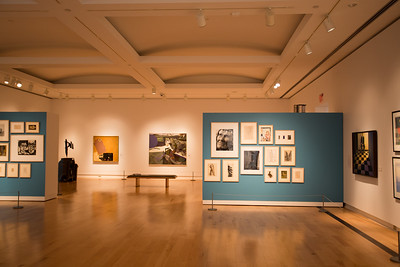

##  Creative Pursuits

- Launch a YouTube Channel or Blog: Regularly create and share content related to my creative passions ( game design, UX insights, photography, or travel) and build an engaged audience.

- Hold an exhibition of My artwork or photography, either in a gallery or through an online platform.

-  Complete a manuscript (fiction, non-fiction, or poetry) and self-publish or submit it to a publisher.

- Explore New Art Forms Experiment with a new medium ( sculpture,or music production) and Dedicate time to learning the basics of a new art form through online tutorials or classes Share My work on social media or a personal website to track progress

