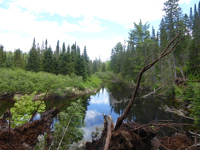

 ## Recreational

- Plan to visit five different countries or continents and immerse myself in the culture, nature, and history of each location I visit currently on my list is Germany, Japan, Korea, China and vietnam.

- Dedicate time to a new hobby or skill, such as learning a musical instrument, martial arts, or cooking from different cultures.

- Buy a brand new car from the dealership not sure why but it has always been on my bucket list

- Commit to exploring the outdoors by regularly hiking, camping, or surfing at new locations, with a goal to visit 10 new nature spots or national parks up in northern Ontario 

 